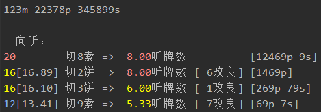
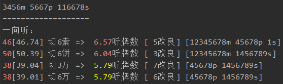
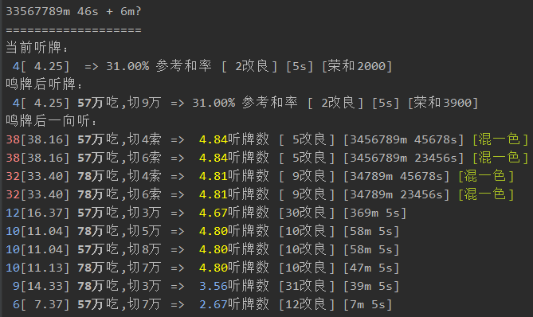

# 日本麻将辅助

## 主要功能

- 对战时自动分析手牌，并给出推荐舍牌
- 有人立直或多副露时，显示各张牌的危险度
- 显示他家手切摸切

详见后面的图文[示例](#示例)

### 支持平台

- 雀魂网页版（国服√ | 日服√ | 国际服√）
- 天凤网页版

## 安装

分下面几步：

1. 前往 [release](https://github.com/EndlessCheng/mahjong-helper/releases/latest) 页面下载程序

2. 安装浏览器扩展 Header Editor（不清楚如何安装可以参考[这篇](https://tieba.baidu.com/p/5956122477?pid=122936988723#122936988723)）

    安装好扩展后点进该扩展的`管理`界面，点击`导入和导出`，在下载规则中填入 `https://jianyan.me/js/mahjong-helper.json`，点击右侧的下载按钮，然后点击下方的`保存`

3. （雀魂需要）允许本地证书通过浏览器，在浏览器（仅限 Chrome 和使用了 Chrome 内核的浏览器）中输入

    ```
    chrome://flags/#allow-insecure-localhost
    ```

    然后把高亮那一项的 Disabled 改成 Enabled（不同浏览器/版本的描述可能不一样，如果是中文的话点击「启用」按钮），之后重启浏览器

（PS：第2步发生了什么见[如何获取 WebSocket 收发的消息](#如何获取WebSocket收发的消息)）

### 从源码安装程序

您也可以选择从源码安装：

`go get -u -v github.com/EndlessCheng/mahjong-helper/...`

完成后程序生成于 `$GOPATH/bin/` 目录下


## 使用说明

按照上述流程安装完成后，启动程序，选择平台即可

雀魂需要先启动本程序，再登录网页

### 有关界面说明

目前程序是在终端窗口下显示信息的

对于 Windows 用户，受 cmd 终端颜色所限，可能会有颜色过暗或过亮的问题

建议下载增强版终端 Cmder（[官网下载](https://cmder.net/) | [百度云备份](https://pan.baidu.com/s/1Hv1nEs4Wu2EHAnKOWOnRaQ) iug7）来获得更好的界面显示


## 参与讨论

吐槽本项目、日麻交流，欢迎加入(刚创建的) QQ 群 [375865038](https://jq.qq.com/?_wv=1027&k=5FyZOgH)


## 示例

### 牌效率

综合了进张数、改良、向听前进后的进张数、和牌率，越好的越靠前

显示如下：

```
进张数[改良后的进张数加权均值] 切哪张牌 => 向听前进后的进张数的加权均值 [改良数] [进张牌] [役种] [是否振听] [荣和点数]
```

补充说明：

- 无改良时不显示改良
- 鸣牌时会显示用手上的哪些牌去吃/碰
- 防守时，切牌的文字颜色会因这张牌的安全程度而不同
- 役种只对较为特殊的进行提示，如三色、一通、七对等，常见的断幺、平和等并不提示
- 听牌或一向听时根据自家舍牌情况提示振听
- 有役听牌时显示（默听）荣和点数，无役时暂不显示

来看看下面几个例子

两面一向听：

按照蓝-黄-红的顺序，进张数越多颜色越红

此例切 8s



包含三个复合搭子的一向听：

这里展示了本程序对于进张与向听前进后进张之间的综合判断，切 6s 最佳



如果听牌型很差，可以考虑向听倒退：

不考虑场况的话，相比切 8m，切 1m 虽然向听倒退但是进张面广且有断幺一役，速度是高于 8m 的


### 鸣牌判断

下图是一个鸣了红中之后（鸣出的牌不显示），听坎 5s 的例子，宝牌为 6m

上家打出 6m 宝牌之后考虑是否鸣牌：

这里就可以考虑用 57m 吃，打出 9m，提升打点的同时又能维持听牌；若巡目尚早可以拆掉 46s 追求混一色



### 手摸切与安牌显示

下图展示了某局中三家的手摸切情况（宝牌为红中和6s，自家手牌此时为 345678m 569p 45667s）：

- 白色为手切，暗灰色为摸切
- 鸣牌后打出的那张牌会用灰底白字显示，供读牌分析用
- 副露玩家的手切中张牌(3-7)会有不同颜色的高亮，用来辅助判断其听牌率
- 玩家立直或听牌率较高时会额外显示对该玩家的安牌，用 | 分隔，左侧为现物，右侧按照危险度由低到高排序（No Chance 和 One Chance 的安牌作为补充参考显示在后面，简写为 NC 和 OC）
- 下图上家亲家暗杠 2m 后 4p 立直，对家 8s 追立，下家一副露但是手切了很多中张牌，听牌率较高
- 多家立直/副露时会显示综合危险度
- `[n无筋]` 指该玩家的无筋危险牌的剩余数量。剩余数越小，无筋牌就越危险；但是当剩余数很小时(<=3)，该玩家更有可能是愚型听牌或振听


补充说明：

- 危险度排序是基于巡目、筋牌、No Chance、早外、宝牌、听牌率等数据的综合考虑结果，对于 One Chance 和其他特殊情况并没有考虑，请玩家自行斟酌
- 某些情况下的 No Chance 安牌，本程序是会将其视作现物的（比如 3m 为壁，剩下的 2m 在牌河和自己手里时，2m 是不会放铳的）


## 其他功能说明

在查看牌谱，或者分析何切题时对一副手牌进行分析，可以输入如下命令：

- 分析何切

    `mahjong-helper 34568m 5678p 23567s`
    
- 分析鸣牌

    `mahjong-helper 33567789m 46s + 6m`

[配套小工具](https://github.com/EndlessCheng/mahjong-helper-gui)


## 如何获取WebSocket收发的消息

1. 打开开发者工具，找到相关 JS 文件，保存到本地
2. 搜索 `WebSocket`, `socket`，找到 `message`, `onmessage` 等函数
3. 修改代码，使用 `XMLHttpRequest` 将收发的消息发送到（在 localhost 开启的）mahjong-helper 服务器，服务器收到消息后会自动进行相关分析
4. 将修改后的 JS 代码传至个人的 github.io 项目，拿到该 JS 文件地址
5. 安装浏览器扩展 Header Editor，重定向原 JS 文件地址到上一步中拿到的地址，具体操作可以参考[这篇](https://tieba.baidu.com/p/5956122477)
6. 允许本地证书通过浏览器，在浏览器（仅限 Chrome 内核）中输入
    
    ```
    chrome://flags/#allow-insecure-localhost
    ```
    
    然后把高亮那一项的 Disabled 改成 Enabled（不同浏览器/版本的描述可能不一样，如果是中文的话点击「启用」按钮）

7. 重启浏览器

下面说明天凤和雀魂的代码注入点

### 天凤 (tenhou)

1. 搜索 `new WebSocket`，找到下方的 `message` 函数，该函数中的 `a.data` 就是 WebSocket 收到的数据
2. 在该函数末尾添加如下代码

    ```javascript
    var req = new XMLHttpRequest();
    req.open("POST", "http://localhost:12121/");
    req.send(a.data);
    ```

### 雀魂 (majsoul)

考虑到雀魂的 WebSocket 收到的是封装后的 protobuf 二进制数据，不好解析，于是另寻他路

大致思路是根据 [liqi.json](https://github.com/EndlessCheng/mahjong-helper/blob/master/liqi.json) 文件提供的对分析玩家操作有用的字段查找相关关键字，如 `ActionDealTile` `ActionDiscardTile` `ActionChiPengGang` 等，具体修改了哪些内容可以对比雀魂的 JS 代码和我修改后的 https://jianyan.me/majsoul/code-v0.1.4.js

PS: 在网页控制台输入 `GameMgr._inRelease = 0` 即可开启调试模式


## License

This project is licensed under the MIT License - see the [LICENSE](LICENSE) file for details.
