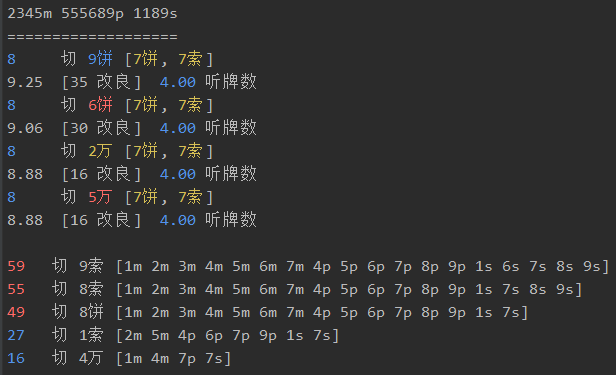
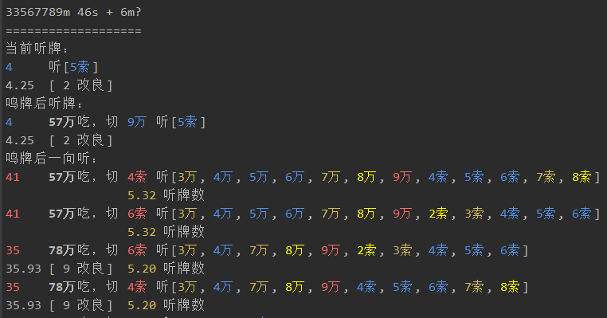

# mahjong-helper

## 安装

分下面几步：

1. 前往 [release](https://github.com/EndlessCheng/mahjong-helper/releases) 页面下载程序

2. 安装浏览器扩展 Header Editor，具体操作可以参考[这篇](https://tieba.baidu.com/p/5956122477)，

    安装好扩展后点进该扩展的`管理`界面，点击`导入和导出`，在下载规则中填入 `https://jianyan.me/js/mahjong-helper.json`，点击右侧的下载按钮，然后点击下方的`保存`

3. （雀魂需要）允许本地证书通过浏览器，在浏览器（仅限 Chrome 内核）中输入

    ```
    chrome://flags/#allow-insecure-localhost
    ```

    然后把高亮那一项的 Disabled 改成 Enabled（不同浏览器/版本的描述可能不一样，如果是中文的话点击「启用」按钮），之后重启浏览器

（PS：第2步发生了什么见[如何获取 WebSocket 收发的消息](#如何获取WebSocket收发的消息)）


### 从源码安装程序

您也可以选择从源码安装：

`go get -u -v github.com/EndlessCheng/mahjong-helper/...`

完成后程序生成于 `$GOPATH/bin/` 目录下


## 服务端脚本说明

分为两种模式

### 手动档

安装[手动档客户端](https://github.com/EndlessCheng/mahjong-helper-gui)，可用于牌谱分析

或者在命令行输入，比如 `mahjong-helper 34568m 5678p 23567s`

### 自动挡

启动程序，选择平台即可

自动化分析会在牌效率上考虑场上已有的牌（含舍牌、副露、宝牌指示牌）；防守方面，提示他家手切模切，并当有人立直或多副露时，将手牌简要地按照筋的危险度进行排序，顺带提醒一下 NC OC


## CLI

### 牌效率

```
进张数               切哪张牌 [哪些牌是进张]
改良后的进张数加权均值 [改良数] 向听前进后的进张数的加权均值
```


如果听牌型很差，额外提供向听倒退的选择



### 鸣牌判断

下图是一个鸣了红中之后（鸣出的牌不显示），听坎 5s 的例子，宝牌为 6m

上家打出了 6m 宝牌之后分析如下：



这里就可以考虑用 57m 吃，打出 9m，提升打点的同时又能维持听牌

## 如何获取WebSocket收发的消息

1. 打开开发者工具，找到相关 JS 文件，保存到本地
2. 搜索 `WebSocket`, `socket`，找到 `message`, `onmessage` 等函数
3. 修改代码，使用 `XMLHttpRequest` 将收发的消息发送到（在 localhost 开启的）mahjong-helper 服务器，服务器收到消息后会自动进行相关分析
4. 将修改后的 JS 代码传至个人的 github.io 项目，拿到该 JS 文件地址
5. 安装浏览器扩展 Header Editor，重定向原 JS 文件地址到上一步中拿到的地址，具体操作可以参考[这篇](https://tieba.baidu.com/p/5956122477)
6. 允许本地证书通过浏览器，在浏览器（仅限 Chrome 内核）中输入
    
    ```
    chrome://flags/#allow-insecure-localhost
    ```
    
    然后把高亮那一项的 Disabled 改成 Enabled（不同浏览器/版本的描述可能不一样，如果是中文的话点击「启用」按钮）

7. 重启浏览器

下面说明天凤和雀魂的代码注入点

### 天凤 (tenhou)

1. 搜索 `new WebSocket`，找到下方的 `message` 函数，该函数中的 `a.data` 就是 WebSocket 收到的数据
2. 在该函数末尾添加如下代码

    ```javascript
    var req = new XMLHttpRequest();
    req.open("POST", "http://localhost:12121/");
    req.send(a.data);
    ```

### 雀魂 (majsoul)

考虑到雀魂的 WebSocket 收到的是封装后的 protobuf 二进制数据，不好解析，于是另寻他路

大致思路是根据 [liqi.json](https://github.com/EndlessCheng/mahjong-helper/blob/master/liqi.json) 文件提供的对分析玩家操作有用的字段查找相关关键字，如 `ActionDealTile` `ActionDiscardTile` `ActionChiPengGang` 等，具体修改了哪些内容可以对比雀魂的 JS 代码和我修改后的 https://jianyan.me/majsoul/code-v0.1.4.js

PS: 在网页控制台输入 `GameMgr._inRelease = 0` 即可开启调试模式
